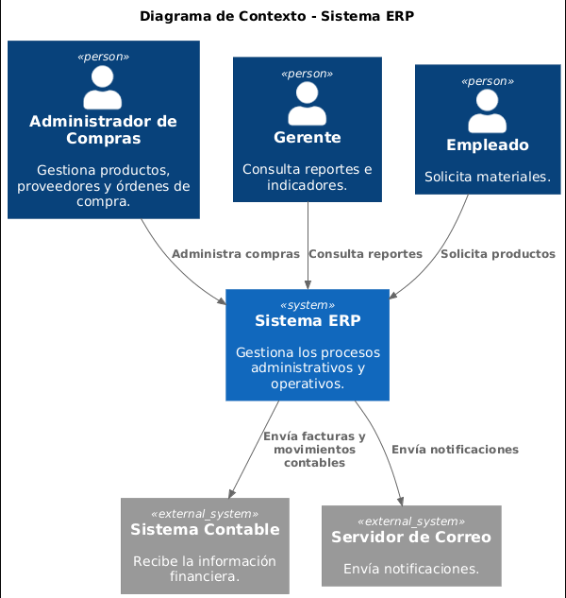

# Alcance y Contexto

El Sistema ERP interactúa con administradores, empleados y gerentes para gestionar el módulo de compras.

También intercambia información con un sistema contable externo.

## Diagrama de Contexto

