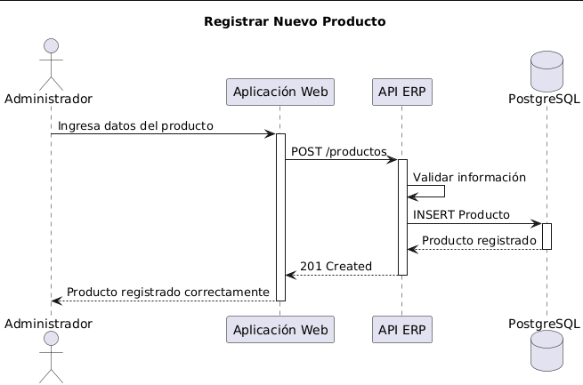

# Vista de Ejecución

## Escenario

Registrar un nuevo producto.

### Flujo

1. El administrador ingresa la información.
2. La aplicación envía los datos.
3. El backend valida la información.
4. Se almacena el producto en la base de datos.
5. El sistema responde con éxito.

## Diagrama de Secuencia

